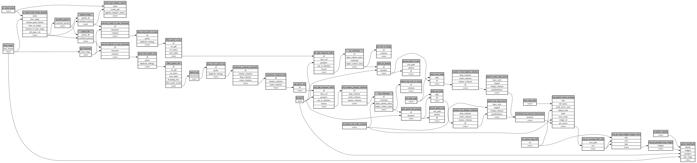

```
# AUTOGENERATED BY ECOSCOPE-WORKFLOWS; see fingerprint in README.md for details

```

```yaml
# fingerprint:
artifacts_sha256_basic: ff77d2578fc74f5eef21e0e487e9c9d641ff5b477628fa63e102f7d99ade115b
artifacts_sha256_strict: 95de8a6308fe2fb43a6e418e7da6ab5adb69ba07580c557a8eea4c5cb30f369c
installed_requirements:
- channel: https://repo.prefix.dev/ecoscope-workflows/
  name: ecoscope-workflows-core
  version: {version: ==0.22.1}
- channel: https://repo.prefix.dev/ecoscope-workflows/
  name: ecoscope-workflows-ext-ecoscope
  version: {version: ==0.22.9}
- channel: https://repo.prefix.dev/ecoscope-workflows-custom/
  name: ecoscope-workflows-ext-custom
  version: {version: ==0.0.28}
params_sha256: e0de769fc2b445eea86e29042e0a2e9fdf41f5f5858ac238af04dff09e84a8e8
spec_sha256: 8271c64beedcb7c5f015e5daccdcad52c0cfce5e01fa61801ee30ae99ed44882

```

# ecoscope-workflows-download-patrols-workflow


