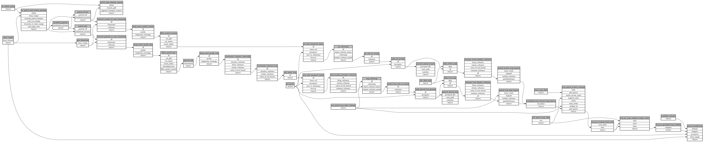

```
# AUTOGENERATED BY ECOSCOPE-WORKFLOWS; see fingerprint in README.md for details

```

```yaml
# fingerprint:
artifacts_sha256_basic: 0fda9f7d16f9a10a248191fb718f7b6bba0ad8ea43edbda716da644e72b77ec0
artifacts_sha256_strict: 061c4c81925e8558ecd2289456170608878459949a14dde9f203d574f623b6fa
installed_requirements:
- channel: https://repo.prefix.dev/ecoscope-workflows/
  name: ecoscope-workflows-core
  version: {version: ==0.22.14}
- channel: https://repo.prefix.dev/ecoscope-workflows/
  name: ecoscope-workflows-ext-ecoscope
  version: {version: ==0.22.16}
- channel: https://repo.prefix.dev/ecoscope-workflows-custom/
  name: ecoscope-workflows-ext-custom
  version: {version: ==0.0.35.dev1+g24fa89326}
params_sha256: b703ff89aaeb1dd3b8f5d9436bdb45333dcbf7c60f550d6ebae824c7b866a1c2
spec_sha256: ccc5e2ed6a2c47a90b3bd8f51170aff6f2fe26e2906490728607039d6ef87575

```

# ecoscope-workflows-download-patrols-workflow


