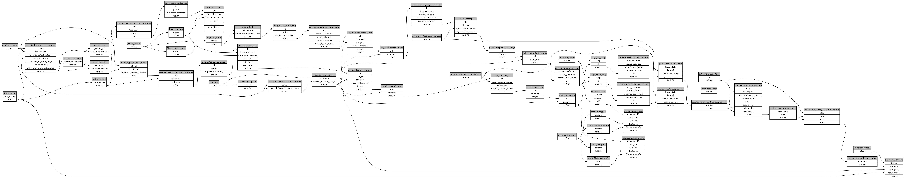

```
# AUTOGENERATED BY ECOSCOPE-WORKFLOWS; see fingerprint in README.md for details

```

```yaml
# fingerprint:
artifacts_sha256_basic: 2f7e3edbd513089efdace909a36bbf31a57c77924aab64044b281ff1c729f473
artifacts_sha256_strict: 69eae54ef7600e7481cf2516c02732030fedbd93431f4dee05e6cef8499a58c4
installed_requirements:
- channel: https://repo.prefix.dev/ecoscope-workflows/
  name: ecoscope-platform
  version: {version: ==2.17.1}
- channel: conda-forge
  name: pydeck
  version: {version: ==0.9.2}
params_sha256: 6be504de5a5c07eb5b1b09c87e64ae5a1060f8a7ab10722da0536988b8f91e3e
spec_sha256: 5fd9f1df100e59cbd864e49dffd1bfb88c1ff049e6d425fefcff9ff754d1c306

```

# ecoscope-workflows-download-patrols-workflow


