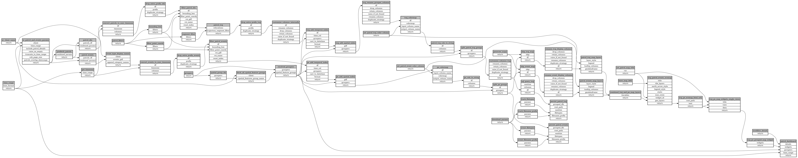

```
# AUTOGENERATED BY ECOSCOPE-WORKFLOWS; see fingerprint in README.md for details

```

```yaml
# fingerprint:
artifacts_sha256_basic: 36118b84f33770caa11ff6d1fec2c37f1d862dbe088fafae953f2b372da7945a
artifacts_sha256_strict: fc7afcf209f3fc417854ab01a694acc37b71bf464f4e9506aa84eef3c998918a
installed_requirements:
- channel: https://repo.prefix.dev/ecoscope-workflows/
  name: ecoscope-platform
  version: {version: ==2.23.0}
- channel: conda-forge
  name: pydeck
  version: {version: ==0.9.2}
params_sha256: d36905a6599c775ccd49d0b49a773402d6933750deac9e8f880098ffe582c75c
spec_sha256: 75b13af7a60a48b501b7df94b74254e4936a905618d7c0b2751d9fbbaddb79d2

```

# ecoscope-workflows-download-patrols-workflow


